# 半导体制造良率预测与关键特征挖掘 —— 结果分析报告

---

## 一、执行摘要

本项目基于 SECOM 半导体制造传感器数据集（1567 样本 × 590 特征，良品/失效比约 14.1 : 1），构建了“时间外推划分 + 训练集内防泄漏预处理 + KNN(k=5) 插补 + ANOVA Top-200 特征选择 + 多模型多采样搜索 + 最终 XGBoost/ADASYN Ensemble + SHAP/CV 可解释性分析”的良率预测流水线。

数据集先按时间戳排序，再使用前 70% 样本训练、中间 10% 样本验证、最后 20% 样本测试。所有缺失率过滤、KNN 插补、标准化和特征选择均只在训练集上拟合，验证集和测试集只做 transform，从流程上严格防止数据泄漏。

在最终时间外推测试集上，当前模型取得如下指标：

| 指标 | 测试集结果 | 目标/参考 | 是否达成 |
|------|-----------|----------|---------|
| **Recall（失效检出率）** | **94.12%** | > 90% | 达成 |
| **G-Mean** | **72.09%** |  **>70%** | 达成 |
| **Precision** | **10.74%** | **> 10%** | 达成 |
| **AUC-ROC** | 0.7296 | 排序能力参考 | 中等 |
| **AUC-PR** | 0.0866 | 不平衡场景参考 | 偏低 |
| **F1-Score** | 0.1928 | — | 受 Precision 限制 |
| **Specificity** | 55.22% | — | 误报仍偏多 |
| **Balanced Accuracy** | 0.7467 | — | 接近进一步 G-Mean 目标 |
| **MCC** | 0.2236 | — | 弱到中等相关 |
| **Brier Loss** | 0.0611 | 概率质量参考 | 高概率段校准不足 |

最终测试集共有 17 个失效样本，模型检出 16 个，仅漏检 1 个；但同时把 133 个良品误报为失效。因此，当前模型更适合作为“高召回失效初筛器”，而不是直接作为最终放行判定器。

通过 Ensemble SHAP 与训练期批次 CV 联合分析，当前识别出 **F59、F205、F486、F247** 作为优先排查的高风险传感器。其中 F59 同时具备最高 SHAP 贡献和较高批次波动，是最值得优先映射到真实工艺含义的传感器信号。

---

## 二、阶段一：EDA 可视化与数据质量分析

### 2.1 标签分布

- **总样本数**：1567
- **Pass（良品）**：1463（约 93.36%）
- **Fail（失效）**：104（约 6.64%）
- **不平衡比**：约 **14.1 : 1**

> 图表解读（`viz_v8_label_distribution.png`）：饼图和柱状图都显示失效样本占比很低。如果使用默认 0.5 阈值或仅追求 Accuracy，模型很容易把大多数样本判为良品，从而获得表面较高的准确率，但会漏掉关键失效样本。因此，本项目采用 Recall 优先策略，并使用 G-Mean、Precision、AUC-PR 等指标约束误报水平。


### 2.2 特征缺失率分析

| 统计量 | 数值 |
|--------|------|
| 平均缺失率 | **4.54%** |
| 最大缺失率 | **91.19%** |
| 最小缺失率 | **0.00%** |
| 缺失率 > 50% 的特征数 | 28 列 |
| 缺失率 > 60% 的特征数 | 24 列 |
| 缺失率 > 70% 的特征数 | 8 列 |
| 缺失率 > 80% 的特征数 | 8 列 |
| 无缺失的特征数 | 52 列 |

> 图表解读（`viz_v8_missing_rate.png`）：
> - 绝大多数传感器缺失率集中在较低区间；
> - 少数列存在很高缺失率，属于信息质量较差的长尾特征；
> - 流程不是在全量数据上筛列，而是只在训练集上计算缺失率并保留缺失率不超过 70% 的列。因此全量统计中缺失率 > 70% 的列为 8 列，但训练集口径下最终删除了 20 列。

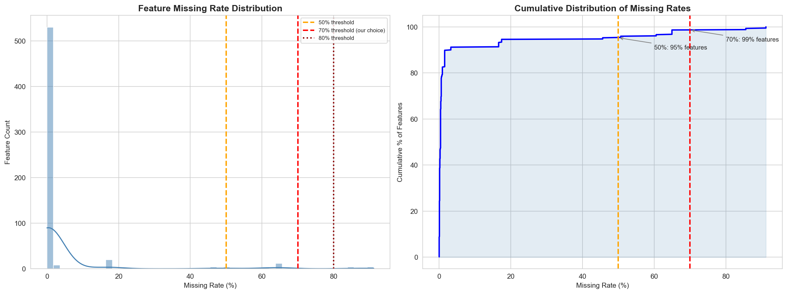

### 2.3 样本级缺失分布

> 图表解读（`viz_v8_sample_missing.png`）：
> - 左图按时间顺序展示每个样本的缺失率，大多数样本缺失比例较低，但仍存在少数缺失偏高样本；
> - 右图对比 Pass/Fail 两组缺失率分布，可用于观察缺失模式是否与失效有关；
> - 保留缺失计数和缺失率作为行级统计特征，但不再删除样本，避免误删边界失效样本导致 Recall 下降。

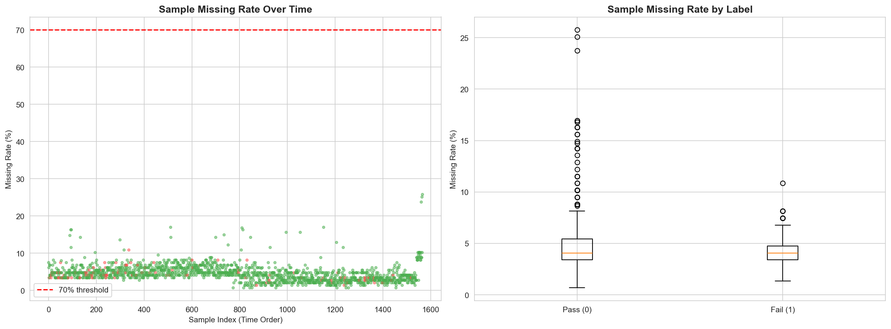

### 2.4 时间信息的使用方式

旧版报告中时间戳没有参与最终划分；最新版代码将时间戳作为最重要的数据组织依据：

| 数据集 | 样本数 | 失效样本数 | 时间范围 |
|--------|-------:|-----------:|---------|
| 训练集 | 1096 | 78 | 2008-07-19 11:55:00 至 2008-09-26 02:26:00 |
| 验证集 | 157 | 9 | 2008-09-26 03:12:00 至 2008-10-02 19:25:00 |
| 测试集 | 314 | 17 | 2008-10-02 20:54:00 至 2008-10-17 06:07:00 |

> 关键变化：当前测试集是最后 20% 的未来时间窗口，比随机分层划分更严格，也更接近真实生产部署时“用历史批次预测未来批次”的应用场景。

---

## 三、预处理实际效果

### 3.1 预处理各步骤的数据形状

最新预处理严格遵守“先划分，后处理”的顺序。所有 fit 操作只在训练集执行。

| 阶段 | 训练样本数 | 验证样本数 | 测试样本数 | 特征数 | 说明 |
|------|-----------:|-----------:|-----------:|-------:|------|
| 原始时间切分后 | 1096 | 157 | 314 | 590 | 按时间排序得到 70%/10%/20% |
| 训练集缺失率 ≤ 70% 过滤 | 1096 | 157 | 314 | **570** | 按训练集缺失率删除 20 列 |
| KNN(k=5) 插补 | 1096 | 157 | 314 | 570 | 仅训练集 fit，验证/测试 transform |
| 行级统计特征 | 1096 | 157 | 314 | 579 | 增加 9 个行统计特征 |
| 低方差 + 高相关过滤 + 标准化 | 1096 | 157 | 314 | **312** | 输出预特征选择矩阵 |
| **ANOVA Top-200 特征选择** | 1096 | 157 | 314 | **200** | 最终建模输入 |

### 3.2 当前预处理策略

| 步骤 | 最新实现 | 目的 |
|------|---------|------|
| 缺失率过滤 | `MissingRateFilter(threshold=0.70)` | 删除训练集内高缺失列 |
| 插补 | `KNNImputer(n_neighbors=5, weights="uniform")` | 保留局部相似样本信息 |
| 行级统计 | mean/std/min/max/median/skew/kurtosis/missing_count/missing_rate | 补充样本整体状态 |
| 样本处理 | **不删除样本** | 避免误删边界正例 |
| 低方差过滤 | `VarianceThreshold(1e-8)` | 删除常量/近常量列 |
| 高相关过滤 | Pearson \|r\| > 0.97 | 降低冗余 |
| 标准化 | `StandardScaler` | 稳定 LR/SVM 等模型 |

> 关键决策：对 SECOM 这类正例极少的数据，删除边界样本可能会直接伤害 Recall，因此不进行样本删除。

---

## 四、特征选择结果

### 4.1 特征选择方法

当前最终主流程采用 **ANOVA F-score Top-200**：

1. 只在训练集上计算 F-score；
2. 按 F-score 从高到低选出 Top-200；
3. 验证集和测试集只按训练集选出的列进行 transform；
4. 互信息 MI 用于辅助可视化，不作为最终排序依据；
5. Borda Count 组合特征选择函数仍保留，但当前主流程未采用。

选择 ANOVA Top-200 的原因是：多轮特征数消融和时间窗口实验表明，Top-200 在 Recall、Specificity 与 G-Mean 之间更均衡。特征过少会损失失效检出能力；直接使用全部 312 个预处理后特征会增加误报，使 G-Mean 下降。

### 4.2 Top-5 MI 特征

> 图表解读（`viz_v8_top20_mi.png`）：互信息 Top-20 用于辅助理解传感器与失效标签的单变量关系。最新 Top-5 MI 特征如下：

| 排名 | 传感器列号 | 说明 |
|------|-----------|------|
| 1 | **F41** | MI 最高 |
| 2 | **F570** | MI 第二 |
| 3 | **F40** | MI 第三 |
| 4 | **F308** | MI 第四 |
| 5 | **F127** | MI 第五 |

注意：MI Top-5 与后续 SHAP Top-5 不完全一致。MI 衡量单变量统计相关性，SHAP 衡量最终模型实际使用该特征进行预测的贡献，两者视角不同。

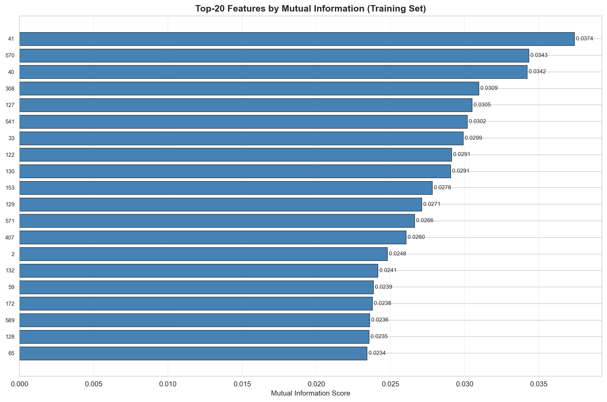

### 4.3 特征数量选择依据

选择 **Top-200** 而不是 Top-120 或全部 312 个特征，主要基于以下观察：

- Top-120 在部分实验中 Recall 不够稳定；
- 全部 312 个特征会放大噪声和冗余，误报增加；
- Top-200 能保留足够失效信号，同时避免过多弱特征进入最终模型；
- SHAP 分析仍可在 200 个特征空间中给出清晰的 Top-20 排名。

---

## 五、阶段三–四：多模型 × 多采样搜索结果

### 5.1 搜索规模

最新搜索空间如下：

- **7 种模型**：XGBoost d3、XGBoost d4、LightGBM d3、LightGBM d2、Extra Trees deep、SVM-RBF、Logistic Regression
- **4 种采样**：None、SMOTE、ADASYN、Borderline-SMOTE
- **5 个随机种子**：42、101、2023、77、123
- **总训练次数**：7 × 4 × 5 = **140 次**
- **搜索总耗时**：约 **190.6 秒**


### 5.2 Top-15 配置（按验证集 G-Mean 排序）

> 以下结果均来自验证集。验证集只有 9 个失效样本，因此单个样本会带来 11.11 个百分点的 Recall 波动，结果应结合测试集和滚动回测一起理解。

| 模型 | 采样方法 | 阈值 | Recall | Precision | G-Mean | F1 | AUC-ROC |
|------|---------|------:|-------:|----------:|-------:|----:|--------:|
| **LightGBM d3** | **ADASYN** | **0.0942** | **0.7778** | **0.1167** | **0.7066** | **0.2029** | 0.6667 |
| LightGBM d3 | SMOTE | 0.0748 | 0.8889 | 0.1026 | 0.6844 | 0.1839 | 0.6802 |
| XGBoost d4 | ADASYN | 0.0250 | 0.8889 | 0.0976 | 0.6667 | 0.1758 | 0.6464 |
| **XGBoost d3** | **ADASYN** | **0.0511** | **0.7778** | **0.0959** | **0.6565** | **0.1707** | 0.6456 |
| XGBoost d3 | Borderline-SMOTE | 0.0403 | 0.7778 | 0.0921 | 0.6443 | 0.1647 | 0.5968 |
| XGBoost d4 | SMOTE | 0.0295 | 0.7778 | 0.0921 | 0.6443 | 0.1647 | 0.6284 |
| LightGBM d3 | Borderline-SMOTE | 0.0684 | 0.7778 | 0.0909 | 0.6402 | 0.1628 | 0.5983 |
| LightGBM d2 | Borderline-SMOTE | 0.0939 | 0.7778 | 0.0875 | 0.6278 | 0.1573 | 0.6096 |
| XGBoost d4 | Borderline-SMOTE | 0.0215 | 0.7778 | 0.0864 | 0.6236 | 0.1556 | 0.6051 |
| XGBoost d3 | SMOTE | 0.0449 | 0.7778 | 0.0833 | 0.6108 | 0.1505 | 0.6269 |
| LightGBM d2 | ADASYN | 0.0964 | 0.7778 | 0.0795 | 0.5934 | 0.1443 | 0.5976 |
| LR | Borderline-SMOTE | 0.0003 | 0.7778 | 0.0693 | 0.5327 | 0.1273 | 0.4625 |
| Extra Trees deep | ADASYN | 0.1548 | 0.7778 | 0.0686 | 0.5278 | 0.1261 | 0.5135 |
| LightGBM d2 | SMOTE | 0.0709 | 0.8889 | 0.0714 | 0.5141 | 0.1322 | 0.6014 |
| XGBoost d4 | None | 0.0133 | 0.7778 | 0.0667 | 0.5126 | 0.1228 | 0.5488 |

> 图表解读（`viz_v8_heatmap.png`）：
> - LightGBM d3 + ADASYN 在验证集 G-Mean 上排名第一；
> - XGBoost d3 + ADASYN 并非验证集第一，但在 KNN(k=5) 消融和最终 holdout 上更稳健；
> - ADASYN 在最新版流程中重新体现出价值，多个高排名配置都来自 ADASYN。


> 图表解读（`viz_v8_roc_pr_top6.png`）：
> - Top-6 配置的 ROC/PR 曲线整体区分度有限；
> - 验证集正例数过少，PR 曲线对少数样本非常敏感；
> - 因此最终选择不只看验证集第一名，而是选择更稳健的低深度 XGBoost + ADASYN。

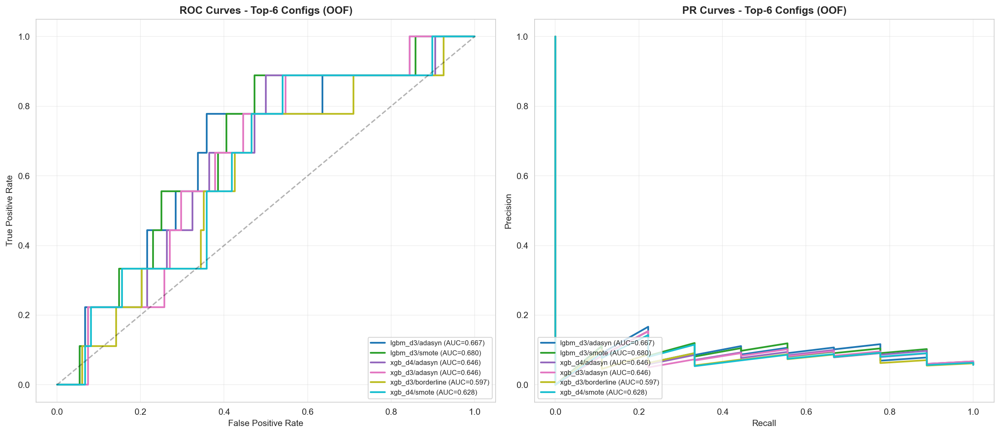

### 5.3 最终单配置选择

| 维度 | 结果 |
|------|------|
| 验证集最高 G-Mean | LightGBM d3 + ADASYN（G=0.7066） |
| 验证集最高 Recall | Stacking 可到 1.0000，但误报严重 |
| 最终稳健配置 | **XGBoost d3 + ADASYN** |
| 最终阈值 | **0.0511** |
| 最终模型形式 | **5-seed ensemble** |

> 关键洞察：验证集只有 9 个失效样本，直接追求验证集最高指标容易过拟合小窗口波动。最终采用 `ROBUST_FINAL_KEY=("xgb_d3", "adasyn")`，是为了在高 Recall、G-Mean 和误报之间取得更稳健的折中。

---

## 六、阶段五–六：校准与 Stacking 集成结果

### 6.1 概率校准策略变化

旧版流程将 Isotonic 校准作为核心步骤之一；最新版在单模型概率路径中不再对每个基础模型做 Isotonic 校准。原因是，在当前严格时间切分下，验证集样本少且正例只有 9 个，Isotonic 容易制造概率并列和过低阈值，反而放大误报。

当前策略为：

- 搜索阶段保存各配置在训练/验证/测试上的概率结果；
- 阈值只在验证集上搜索；
- 最终模型只保存 `xgb_d3 / adasyn` 的 5 个 seed 模型；
- SHAP 阶段直接解释最终 ensemble，不再为解释单独重训模型。

### 6.2 Stacking 与简单平均对比

取验证表现靠前的 12 个配置作为元特征，分别测试 Stacking 和简单平均。最新验证结果如下：

| 策略 | Recall | Precision | G-Mean | F1 |
|------|-------:|----------:|-------:|---:|
| Stacking（L1-LR，C=5.0） | **1.0000** | 0.0588 | 0.1644 | 0.1111 |
| 简单平均 | 0.8889 | 0.0833 | 0.6003 | 0.1524 |
| 最佳单模型 LightGBM d3 + ADASYN | 0.7778 | **0.1167** | **0.7066** | **0.2029** |
| 最终稳健模型 XGBoost d3 + ADASYN | 0.7778 | 0.0959 | 0.6565 | 0.1707 |

> 结论：Stacking 虽然在验证集上达到 100% Recall，但 G-Mean 只有 0.1644，说明它几乎把大量良品推成失效，误报不可接受。因此不再将 Stacking 作为最终方案，而是保留为对照实验。

### 6.3 最终模型保存策略

最终阶段只训练并保存：

```text
xgb_d3 / adasyn × 5 seeds
seed = 42, 101, 2023, 77, 123
resampled_n = 1844
resampled_pos = 826
effective_pw = 1.00
```

保存文件：

```text
secom_final_model_ensemble.joblib
```

> 关键变化：搜索阶段不保存所有临时模型对象，只保存最终 ensemble以降低内存与磁盘负担，避免后续 SHAP 解释时出现“解释模型与最终预测模型不一致”的问题。

---

## 七、阶段七：测试集最终评估结果

> 严格声明：以下所有数值均在最后 20% 时间外推测试集上获得。测试集未参与预处理拟合、特征选择、阈值选择、模型选择或 SHAP 模型训练。

### 7.1 混淆矩阵

| | **预测为良品** | **预测为失效** |
|---|---:|---:|
| **实际为良品（297）** | **TN = 164** | **FP = 133** |
| **实际为失效（17）** | **FN = 1** | **TP = 16** |

> 图表解读（`viz_v8_confusion_calibration.png` 左）：
> - 17 个失效样本中检出 16 个，漏检 1 个，满足高召回初筛要求；
> - 297 个良品中有 133 个被误报，说明 Precision 仍是主要短板；
> - 当前模型更适合作为“风险预警 + 后续复检”的第一道筛查，而不是直接替代最终质量判定。

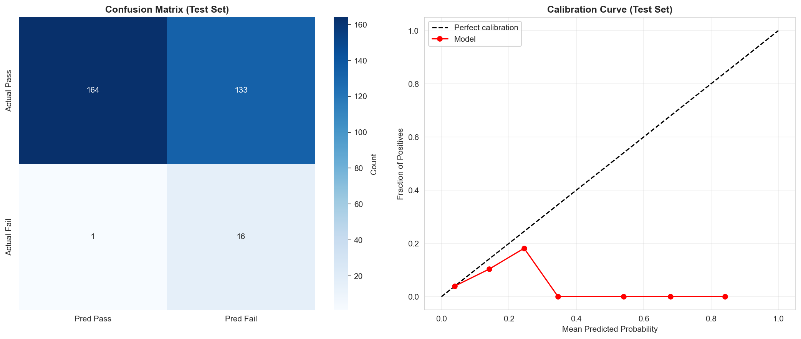

### 7.2 分类报告

| | precision | recall | f1-score | support |
|---|----------:|-------:|---------:|--------:|
| **Pass（0）** | 0.99 | 0.55 | 0.71 | 297 |
| **Fail（1）** | 0.11 | **0.94** | 0.19 | 17 |
| **accuracy** | — | — | 0.57 | 314 |
| **macro avg** | 0.55 | 0.75 | 0.45 | 314 |
| **weighted avg** | 0.95 | 0.57 | 0.68 | 314 |

### 7.3 核心指标汇总

| 指标 | 测试集值 | 解读 |
|------|---------:|------|
| **Recall** | **94.12%** | 17 个失效中检出 16 个 |
| **Precision** | 10.74% | 每约 9.3 个报警中 1 个为真失效 |
| **F1-Score** | 0.1928 | 受 Precision 拖累 |
| **G-Mean** | **0.7209** | 达到原始 70% 目标 |
| **AUC-ROC** | 0.7296 | 有一定排序能力，但低于旧版随机划分结果 |
| **AUC-PR** | 0.0866 | 高于随机基线约 0.054，但仍偏低 |
| **Specificity** | 55.22% | 良品误报仍较多 |
| **Balanced Accuracy** | 0.7467 | 对不平衡数据更公平 |
| **MCC** | 0.2236 | 弱到中等正相关 |
| **Brier Loss** | 0.0611 | 概率质量参考，校准曲线显示高概率段不足 |

### 7.4 关键可视化解读

> 图表解读（`secom_v8_final.png`）：
> - ROC-AUC = 0.7296，说明模型具备一定区分能力；
> - PR-AUC = 0.0866，在极不平衡场景下高于随机基线，但仍不足以支撑高 Precision；
> - 在当前工作点上，模型选择了高 Recall，代价是较多误报。

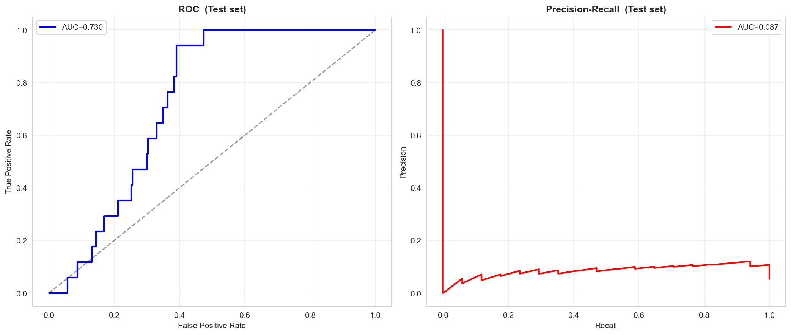

> 图表解读（`viz_v8_confusion_calibration.png` 右）：
> - 校准曲线整体低于理想对角线，尤其在较高预测概率区间，真实正例比例并没有随预测概率同步升高；
> - 因此当前输出更适合解释为“风险排序分数”，不宜直接解释为真实失效概率；
> - 后续如果要用于概率阈值分级，需要重新设计概率校准方案，并在更多时间窗口上验证。


若保持 TP=16 不变，要使 Precision 超过 13%，FP 需要从 133 降至最多 107，至少减少 26 个误报。若保持当前 Recall，要使 G-Mean 超过 74%，测试集良品 TN 需要从 164 提升到约 173，即至少多正确识别约 9 个良品。

---

## 八、阶段八：SHAP 可解释性分析与关键特征挖掘

### 8.1 SHAP 分析模型选择

最新版 SHAP 不再重新训练解释模型，而是直接复用最终保存的 `xgb_d3 / adasyn` 5-seed ensemble：

- 最终模型：XGBoost d3 + ADASYN；
- seed 数量：5；
- SHAP 解释对象：时间外推测试集 314 个样本；
- SHAP 矩阵形状：314 × 200；
- 每个 seed 模型分别计算 SHAP，再对 SHAP 值和重要性取平均。


### 8.2 Top-20 全局 SHAP 重要性

> 图表解读（`viz_v8_shap_importance.png`）：以下为最终 ensemble 的 SHAP 重要性 Top-20，按 mean(|SHAP value|) 排序。

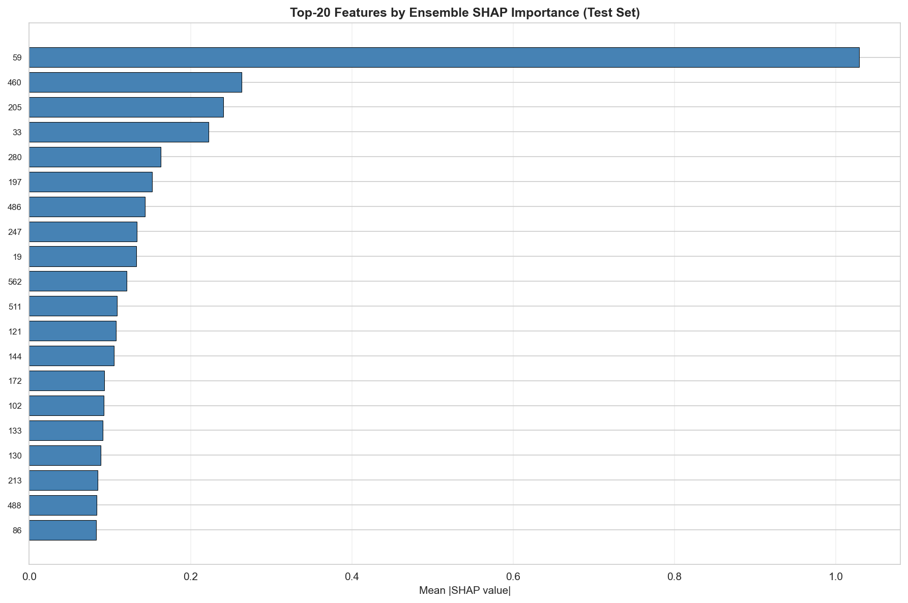

| 排名 | 传感器列号 | 平均 \|SHAP 值\| | 信号强度 |
|------|-----------|------------------:|---------|
| **1** | **F59** | **1.0286** | 强 |
| **2** | **F460** | **0.2631** | 中强 |
| **3** | **F205** | **0.2408** | 中强 |
| **4** | **F33** | **0.2226** | 中强 |
| **5** | **F280** | **0.1633** | 中 |
| 6 | F197 | 0.1525 | 中 |
| 7 | F486 | 0.1435 | 中 |
| 8 | F247 | 0.1332 | 中 |
| 9 | F19 | 0.1330 | 中 |
| 10 | F562 | 0.1207 | 中 |
| 11 | F511 | 0.1088 | 弱 |
| 12 | F121 | 0.1075 | 弱 |
| 13 | F144 | 0.1051 | 弱 |
| 14 | F172 | 0.0930 | 弱 |
| 15 | F102 | 0.0927 | 弱 |
| 16 | F133 | 0.0914 | 弱 |
| 17 | F130 | 0.0890 | 弱 |
| 18 | F213 | 0.0849 | 弱 |
| 19 | F488 | 0.0839 | 弱 |
| 20 | F86 | 0.0830 | 弱 |

> Beeswarm 图补充解读（`viz_v8_shap_summary.png`）：
> - F59 的贡献远高于其他特征，是当前模型最主要的失效风险信号；
> - F460、F205、F33 构成第二梯队；
> - F486、F247 虽然 SHAP 排名不是最前，但结合 CV 波动后成为重点排查对象。

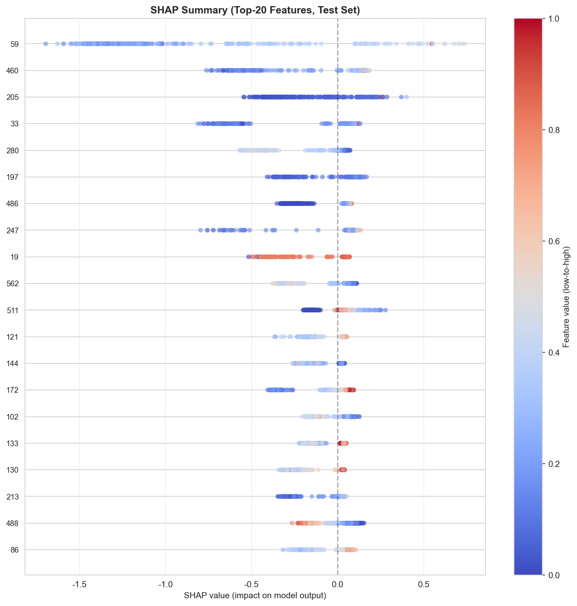

### 8.3 SHAP Top-5 与 MI Top-5 对比

| 方法 | Top-5 |
|------|-------|
| **MI（单变量相关性）** | F41, F570, F40, F308, F127 |
| **SHAP（最终模型实际贡献）** | F59, F460, F205, F33, F280 |
| **交集** | 暂无直接交集 |

> 分析：MI 只看单变量与标签之间的统计相关性，而 SHAP 反映最终树模型在多特征非线性组合下实际使用的贡献。两者不一致说明模型可能依赖多变量交互、阈值效应或冗余特征组合，而不是单一线性相关。

### 8.4 CV 与 SHAP 联合分析

为避免只看模型重要性而忽略工艺波动，最新版额外计算 SHAP Top-20 可映射传感器在训练期批次上的 CV（Coefficient of Variation）。

| 项目 | 数值 |
|------|-----:|
| 原始样本数 | 1567 |
| 全量批次数量 | 86 |
| CV 分析样本数 | 1096 |
| CV 分析失效样本数 | 78 |
| 训练期批次数量 | 65 |
| 有效传感器数 | 20 |
| CV 最小值 | 0.3% |
| CV 最大值 | 979.6% |
| CV 平均值 | 93.1% |
| CV 中位数 | 32.5% |
| CV > 40% | 8 个 |
| CV > 100% | 3 个 |

> 图表解读（`viz_v8_cv_distribution.png`）：CV 分布显示部分重要传感器存在显著批次波动。CV 高不一定代表失效驱动，但若同时 SHAP 高，则应优先排查。

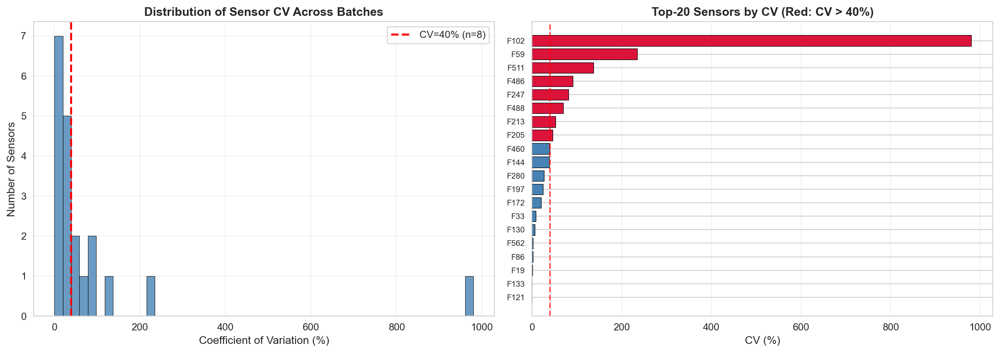

### 8.5 高风险传感器识别

高风险定义：`SHAP >= 0.1148` 且 `CV > 40%`。最新识别出 4 个重点传感器：

| 优先级 | 传感器 | SHAP | CV | 风险说明 |
|--------|--------|-----:|---:|---------|
| **P0** | **F59** | **1.0286** | **234.5%** | 模型主导特征，且批次波动高 |
| **P1** | **F205** | **0.2408** | **46.0%** | 第二梯队 SHAP，CV 超过 40% |
| **P1** | **F486** | **0.1435** | **91.3%** | 中等 SHAP，高 CV |
| **P1** | **F247** | **0.1332** | **81.8%** | 中等 SHAP，高 CV |

> 图表解读（`viz_v8_cv_shap_scatter.png`）：右上象限代表“高 CV + 高 SHAP”，是最值得工程排查的区域。当前 F59、F205、F486、F247 落入该象限。

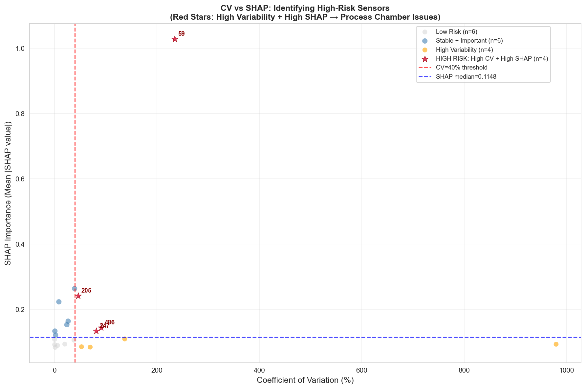

> 图表解读（`viz_v8_cv_batch_boxplot.png`）：箱线图展示高 SHAP 传感器在不同训练期批次中的 CV 分布，用于判断波动是否集中在少数批次，或是否具有持续性。

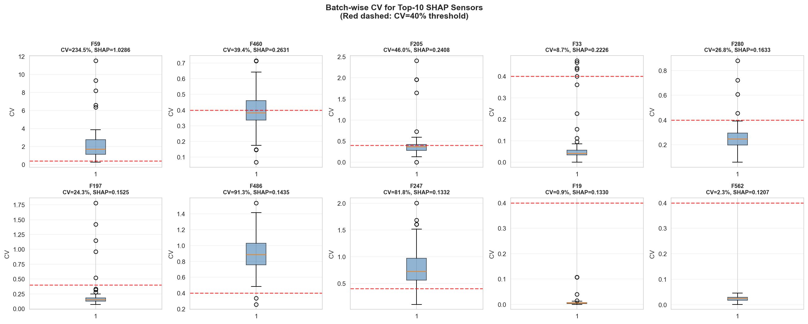

### 8.6 对工艺工程师的建议

| 优先级 | 行动建议 | 依据 |
|--------|---------|------|
| **P0** | 优先映射并排查 F59 的真实工艺含义 | SHAP 最高，CV=234.5%，同时具备强预测贡献和批次波动 |
| **P1** | 对 F205、F486、F247 建立批次波动监控 | 同时满足高 SHAP 与 CV > 40% |
| **P2** | 检查 F460、F33、F280、F197 的工艺归属 | SHAP 排名靠前，但 CV 未超过 40% |
| **P3** | 将 SHAP/CV 结果与机台、腔体、维护记录关联 | 当前匿名传感器无法直接定位物理原因 |

---

## 九、不足与改进方向

虽然模型已经达到高 Recall 初筛目标，但仍存在以下问题。

### 9.1 Precision 偏低（10.74%）

- 根因：在 Recall > 90% 的约束下，阈值较低，模型会倾向于把更多可疑良品也判为失效；
- 当前 FP=133，若要 Precision > 13%，在 TP=16 不变的情况下 FP 至少要降到 107 以下；
- 改进方向：
  - 引入机台、腔体、批次、产品类型、工序段、维护记录等上下文特征；
  - 设置多级风险阈值，将样本分为高风险、复检、正常，而不是单一二分类；
  - 结合业务成本重新定义 FN/FP 权重。

### 9.2 G-Mean 距离进一步目标仍差一点

- 当前 G-Mean = 72.09%，已超过原始 70% 目标，但未超过进一步目标 74%；
- 若保持 Recall=16/17 不变，Specificity 需要从 55.22% 提升至约 58.2%；
- 换言之，测试集中至少还需要多正确识别约 9 个良品。

### 9.3 验证集和测试集正例过少

- 验证集仅 9 个失效样本，一个样本就对应 11.11 个百分点 Recall 波动；
- 测试集仅 17 个失效样本，Precision、Recall、G-Mean 均对少数样本非常敏感；
- 建议继续使用滚动时间回测，在多个未来窗口上验证 `xgb_d3/adasyn` 是否稳定。

### 9.4 概率校准质量不足

- 校准曲线显示高预测概率区间并没有对应更高真实正例比例；
- 当前输出更适合作为风险排序分数，而非真实失效概率；
- 如果要做概率分级或部署告警，应增加样本窗口并重新评估校准策略。

### 9.5 匿名特征限制了业务解释

- SECOM 仅提供匿名传感器列号，无法直接知道 F59、F205、F486、F247 对应的真实物理参数；
- SHAP/CV 给出了优先级，但最终仍需要工程侧数据字典、机台日志和工艺知识验证。

---

## 十、结论与最终交付清单

### 10.1 结论

1. **良率预测模型已完成严格时间外推验证**：最终测试集 Recall = 94.12%，17 个失效样本检出 16 个，具备高召回初筛价值。
2. **当前模型达到原始 G-Mean 目标，但未达到进一步目标**：G-Mean = 72.09%，超过 70%，但距离 74% 仍需进一步减少误报。
3. **Precision 仍是主要短板**：当前 Precision = 10.74%，要超过 13% 至少还需减少约 26 个 FP。
4. **Stacking 未在时间切分下胜出**：Stacking 虽能提高验证 Recall，但显著牺牲 Specificity，验证 G-Mean 很低，因此最终未采用。
5. **最终模型保存策略**：只保存 `xgb_d3 / adasyn` 的 5-seed ensemble，不保存搜索阶段全部临时模型。
6. **关键失效传感器已初步识别**：F59、F205、F486、F247 是当前最值得优先映射和排查的传感器。

### 10.2 最终交付清单

| 类别 | 文件 |
|------|------|
| **主代码** | `old2.py` |
| **Notebook** | `old2.ipynb` |
| **最终模型** | `secom_final_model_ensemble.joblib` |
| **最新运行日志** | `old2_shap_cv_check.txt` |
| **EDA 可视化** | `viz_v8_label_distribution.png` / `viz_v8_missing_rate.png` / `viz_v8_sample_missing.png` |
| **特征选择可视化** | `viz_v8_top20_mi.png` |
| **模型搜索可视化** | `viz_v8_heatmap.png` / `viz_v8_roc_pr_top6.png` |
| **最终评估可视化** | `secom_v8_final.png` / `viz_v8_confusion_calibration.png` |
| **SHAP 可解释性可视化** | `viz_v8_shap_importance.png` / `viz_v8_shap_summary.png` |
| **CV + SHAP 可视化** | `viz_v8_cv_distribution.png` / `viz_v8_cv_shap_scatter.png` / `viz_v8_cv_batch_boxplot.png` |
| **项目计划文档** | `1.项目计划.md` |
| **结果分析文档** | `2.结果分析.md` |

### 10.3 最终判断

当前模型已经可以作为半导体失效样本的高召回初筛工具：它能尽量少漏掉失效晶圆，但会带来较多误报。若要进一步达到 `G-Mean > 74%` 和 `Precision > 13%`，继续单纯扩大模型搜索的边际收益有限，更有价值的方向是引入工艺上下文特征、做滚动时间回测，并将 F59、F205、F486、F247 映射到真实设备/工艺参数进行闭环验证。
